# Validation-led RQ report — 16 September 2026

This is the primary thesis view. Terminal-led campaigns are excluded. Fixed-search 30-minute and two-hour figures are deterministic cutoffs of the same six-hour runs, not separate reruns. Block Grouping and Counters use narrow fixed search (5 retained children, 20 simulations); Drone, FO Counters and Rover use normal fixed search (20 children, 70 simulations). Counts are solved test instances; Counters has 59 instances and the other domains have 20.

Effects are seed-paired mean differences; confidence intervals are paired t-intervals; raw p-values are two-sided exact sign-flip tests; Holm correction is applied separately within each RQ × stage × cutoff × estimand family. Stage-1 fixed-search families now include six domains with final MPrime results; Stage 2 contains the five completed validation-led domains. PW uses separate families and is never pooled with fixed search. **Bold entries are Holm-significant at .05; raw-only significance is not bolded.**

MPrime is not yet admitted to RQ1/RQ3: Phase C selected Phase-B replicate A as the validator and the complete anchor rescore froze coefficient 30 for VH-off and 10 for VH-on. A final identity audit found that mixing two older candidate lineages with eighteen current-build lineages would create avoidable build heterogeneity, so all twenty clean validation-led Stage-2 lineages were launched uniformly. This is separate from the completed Stage-1 fixed-MCTS and PW70 evidence, which is already included in RQ2/RQ4.

## RQ1 — Does Stage-2 training improve policy coverage without a value head?

| Domain | Stage-1 policy | Stage-2 policy | Δ [95% CI] | Raw / Holm p |
|---|---|---|---|---|
| Block Grouping | 16.3 | 16 | -0.3 [-1.2, 0.6] | 0.625 / 1 |
| Drone | 5.9 | 6.7 | 0.8 [-1.27, 2.87] | 0.5039 / 1 |
| FO Counters | 4.2 | 2.9 | -1.3 [-2.37, -0.23] | 0.0469 / 0.2344 |
| Rover | 4 | 4 | 0 [0, 0] | 1 / 1 |
| Counters | 32.5 | 36.9 | 4.4 [-17.44, 26.24] | 0.6602 / 1 |

**Conclusion:** Stage 2 does not produce a Holm-significant VH-off policy improvement. FO Counters has a raw decline; Counters has a positive but highly variable mean.

### RQ1 extension: PRESERVE-3 validation-led domains

These stable-domain cells are reported separately from the primary five-domain multiplicity family. The paired held-out eight-seed contrast is the cleaner confirmation view; the all-ten means and inference are also shown so the two tuning seeds are not hidden.

| Domain | n | Stage-1 all 10 | Stage-2 all 10 | Held-out 8: S1 → S2 | Held-out Δ [95% CI]; raw/Holm p | All-10 Δ [95% CI] | All-10 raw/Holm p | Conclusion |
|---|---|---|---|---|---|---|---|---|
| Delivery | 10 (8 held-out + 2 tuning) | 19.8 | 19.6 | 19.75 → 19.5 | -0.25 [-1.32, 0.82]; p=1/1 | -0.2 [-1.01, 0.61] | 1 / 1 | Preserved on average |
| TPP | 10 (8 held-out + 2 tuning) | 20 | 18.9 | 20 → 18.62 | -1.38 [-4.63, 1.88]; p=1/1 | -1.1 [-3.59, 1.39] | 1 / 1 | TPP/off: nine seeds=20/20; seed 1972442430=9/20. A fresh selected-pair one-epoch rollback/LR-backtracking rerun yielded 20/20 for the bad seed and stable control, apparently preventing the analogous collapse; retries resampled dropout, so exact-RNG closure remains required and this is not a population-level replacement result. |
| Zenotravel | 10 (8 held-out + 2 tuning) | 20 | 20 | 20 → 20 | 0 [0, 0]; p=1/1 | 0 [0, 0] | 1 / 1 | Preserved on average |

**Extension conclusion:** Delivery and Zenotravel are preserved. TPP is preserved in nine of ten VH-off seeds, but one predeclared held-out seed collapses to 9/20; that outlier is a real seed-specific failure and is not hidden by the 18.9 mean. A deliberately selected fresh rerun reached 20/20 for the bad seed and one stable control under rollback/learning-rate backtracking, apparently preventing the analogous first-update collapse. Because rejected retries resampled dropout, this is encouraging selected-pair prevention evidence awaiting exact-RNG closure, not a new ten-seed Stage-2 estimate.

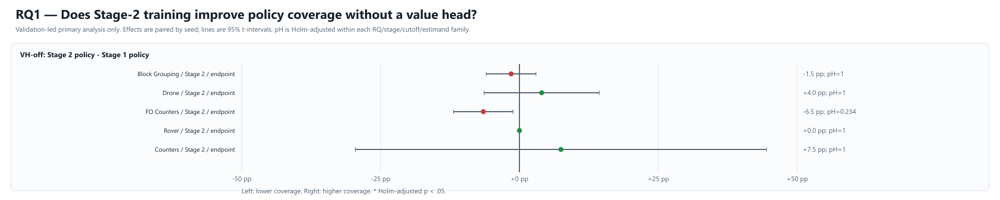

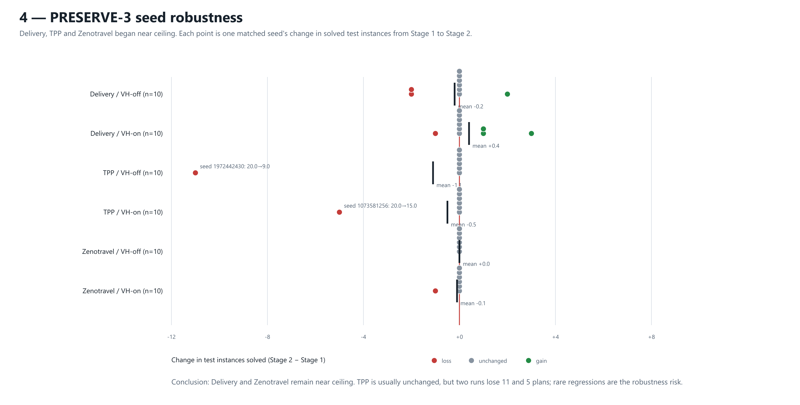

## RQ2 — Does inference-time search improve coverage without a value head?

### Fixed search

All fixed-search rows below use the historical final action-index tie-break. The live policy-prior candidate is a separate causal experiment and has not changed any RQ value in this table.

| Stage | Domain | Search | Policy | 30m: MCTS; Δ [95% CI]; raw/Holm p | 2h | 6h |
|---|---|---|---|---|---|---|
| Stage 1 | Block Grouping | Narrow 5/20 | 16.3 | **11.6; -4.7 [-5.53, -3.87]; p=0.002/0.0117** | 14.8; -1.5 [-2.68, -0.32]; p=0.0352/0.1562 | 15.4; -0.9 [-1.88, 0.08]; p=0.1094/0.3281 |
| Stage 1 | Drone | Normal 20/70 | 5.9 | 6.9; +1 [0.05, 1.95]; p=0.0742/0.1875 | 6.9; +1 [0.05, 1.95]; p=0.0742/0.2227 | 6.9; +1 [0.05, 1.95]; p=0.0742/0.2969 |
| Stage 1 | FO Counters | Normal 20/70 | 4.2 | **7.5; +3.3 [2.04, 4.56]; p=0.0039/0.0195** | **7.8; +3.6 [2.2, 5]; p=0.0039/0.0234** | **7.8; +3.6 [2.2, 5]; p=0.0039/0.0234** |
| Stage 1 | Rover | Normal 20/70 | 4 | 4.8; +0.8 [0.06, 1.54]; p=0.0625/0.1875 | 5; +1 [0.25, 1.75]; p=0.0312/0.1562 | 5; +1 [0.25, 1.75]; p=0.0312/0.1562 |
| Stage 1 | Counters | Narrow 5/20 | 32.5 | 24.9; -7.6 [-18.52, 3.32]; p=0.2031/0.2031 | 25.6; -6.9 [-17.95, 4.15]; p=0.25/0.25 | 25.7; -6.8 [-17.73, 4.13]; p=0.25/0.5 |
| Stage 1 | MPrime | Normal 20/70 | 16.3 | **13; -3.3 [-5.18, -1.42]; p=0.0098/0.0391** | 14.7; -1.6 [-3.48, 0.28]; p=0.1133/0.2266 | 15.7; -0.6 [-2, 0.8]; p=0.4453/0.5 |
| Stage 2 | Block Grouping | Narrow 5/20 | 16 | **11.4; -4.6 [-5.37, -3.83]; p=0.002/0.0098** | 15; -1 [-2.01, 0.01]; p=0.0938/0.375 | 15.7; -0.3 [-0.89, 0.29]; p=0.5/1 |
| Stage 2 | Drone | Normal 20/70 | 6.7 | 7.5; +0.8 [-0.58, 2.18]; p=0.3594/0.7188 | 7.7; +1 [-0.43, 2.43]; p=0.1953/0.3906 | 7.7; +1 [-0.43, 2.43]; p=0.1953/0.5859 |
| Stage 2 | FO Counters | Normal 20/70 | 2.9 | **6.1; +3.2 [1.74, 4.66]; p=0.002/0.0098** | **6.1; +3.2 [1.74, 4.66]; p=0.002/0.0098** | **6.1; +3.2 [1.74, 4.66]; p=0.002/0.0098** |
| Stage 2 | Rover | Normal 20/70 | 4 | 4.5; +0.5 [-0.01, 1.01]; p=0.125/0.375 | 4.5; +0.5 [-0.01, 1.01]; p=0.125/0.375 | 4.5; +0.5 [-0.01, 1.01]; p=0.125/0.5 |
| Stage 2 | Counters | Narrow 5/20 | 36.9 | 34.9; -2 [-6.93, 2.93]; p=0.5/0.7188 | 36.7; -0.2 [-2.87, 2.47]; p=0.9688/0.9688 | 36.7; -0.2 [-2.87, 2.47]; p=0.9688/1 |

**Conclusion:** FO Counters is the clear fixed-search success at both stages and all three cutoffs; Drone and Rover improve modestly. Block Grouping needs the longer budget to approach parity, while Counters can be harmed. The final FO Stage-2 recovery timed out on its exact six-hour instance budget, so the exact mean remains 6.1/20 and the previously partial row is now final.

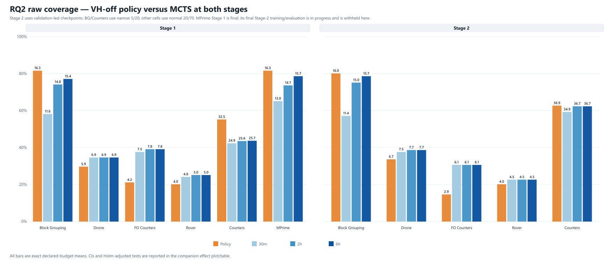

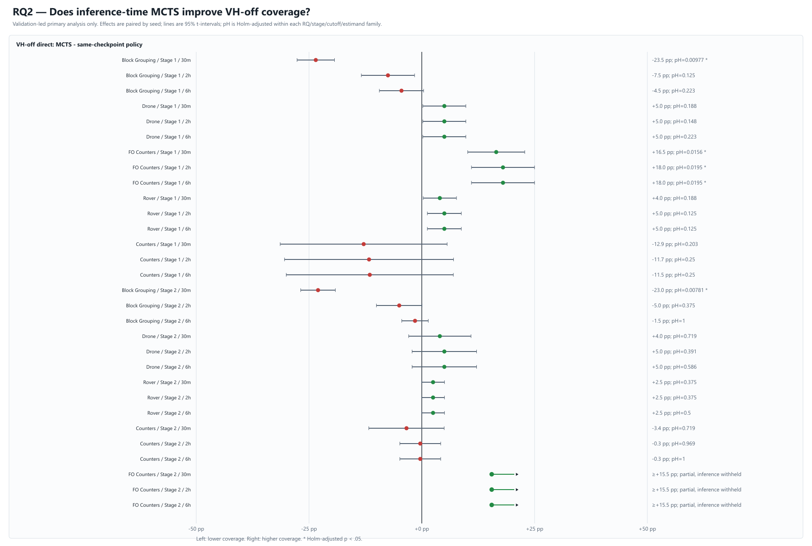

### Progressive widening (PW70; Stage 1 confirmation)

| Domain | n | Policy | Fixed MCTS 30m / 2h / 6h | PW70 30m / 2h / 6h | PW−policy [95% CI] at 30m / 2h / 6h | Raw/Holm p | PW−fixed [95% CI] at 30m / 2h / 6h | Raw/Holm p |
|---|---|---|---|---|---|---|---|---|
| FO Counters | 10 | 4.2 | 7.5 / 7.8 / 7.8 | 8.4 / 8.4 / 8.4 | **4.2 [3.26, 5.14]** / **4.2 [3.26, 5.14]** / **4.2 [3.26, 5.14]** | **0.002/0.0059** / **0.002/0.0059** / **0.002/0.0059** | 0.9 [-0.34, 2.14] / 0.6 [-0.71, 1.91] / 0.6 [-0.71, 1.91] | 0.1953/0.3906 / 0.4219/0.8438 / 0.4219/0.8438 |
| Rover | 10 | 4 | 4.8 / 5 / 5 | 4.7 / 4.7 / 4.7 | 0.7 [0.02, 1.38] / 0.7 [0.02, 1.38] / 0.7 [0.02, 1.38] | 0.125/0.25 / 0.125/0.2422 / 0.125/0.2109 | -0.1 [-1.29, 1.09] / -0.3 [-1.37, 0.77] / -0.3 [-1.37, 0.77] | 1/1 / 0.6875/0.8438 / 0.6875/0.8438 |
| MPrime | 10 | 16.3 | 13 / 14.7 / 15.7 | 15.7 / 17.6 / 17.7 | -0.6 [-2.19, 0.99] / 1.3 [-0.25, 2.85] / 1.4 [-0.19, 2.99] | 0.4922/0.4922 / 0.1211/0.2422 / 0.1055/0.2109 | **2.7 [1.87, 3.53]** / **2.9 [1.92, 3.88]** / **2 [1.05, 2.95]** | **0.002/0.0059** / **0.002/0.0059** / **0.0039/0.0117** |

**Conclusion:** PW70 gives large, corrected-significant VH-off FO Counters gains already at 30 minutes. Rover is approximately fixed-search parity, without a significant VH-off policy gain. MPrime VH-off PW70 significantly beats fixed search at every cutoff and exceeds its policy descriptively by 2h/6h. The corresponding VH-on results are reported under RQ4. These were the only cells promoted to ten seeds: the eight-seed Drone Kmin=3 extension and two-seed corrected Block Grouping screens lost fixed-search coverage, while the five-seed Counters confirmation did not establish a reliable advantage. The earlier accidental PW20 Block Grouping/Counters screen remains documented separately and is never pooled with PW70.

The following are **descriptive exploratory screens**, not confirmatory families. CIs/tests were intentionally withheld because these small cells selected which branches to promote; they are not forgotten results.

| Screen not promoted | Method | n | Policy | Fixed 30m / 2h / 6h | PW 30m / 2h / 6h | Decision |
|---|---|---:|---:|---:|---:|---|
| Drone, Kmin=3 | PW70 | 8 | 7.0/20 | 10.25 / 10.5 / 10.5 | 9.5 / 9.5 / 9.5 | Better runtime tail, but lost eight matched fixed successes |
| Block Grouping/off | PW20 | 2 | 16.5/20 | 11.0 / 13.5 / 15.0 narrow | 11.5 / 15.0 / 15.0 | Fixed parity only at 6h |
| Block Grouping/on | PW20 | 2 | 17.0/20 | 11.5 / 13.5 / 17.0 narrow | 12.5 / 17.0 / 18.0 | No runtime gain; tiny final mean gain |
| Block Grouping/off | PW70 | 2 | 16.5/20 | 11.0 / 13.5 / 15.0 narrow | 10.5 / 11.5 / 13.0 | Lost fixed coverage |
| Block Grouping/on | PW70 | 2 | 17.0/20 | 11.5 / 13.5 / 17.0 narrow | 9.0 / 11.5 / 13.5 | Lost fixed coverage |
| Counters S1/off | PW20 | 2 | 18.0/59 | 21.5 / 21.5 / 21.5 narrow | 20.5 / 20.5 / 20.5 | Slightly below fixed |
| Counters S1/on | PW20 | 2 | 5.0/59 | 13.5 / 13.5 / 13.5 narrow | 12.5 / 12.5 / 12.5 | Slightly below fixed |
| Counters S2/off | PW20 | 2 | 49.0/59 | ≥37.0 / ≥41.5 / 44.5 narrow | 46.0 / 49.5 / 49.5 | Restored policy mean in this screen |
| Counters S2/on | PW20 | 2 | 5.0/59 | 16.5 / 17.5 / 17.5 narrow | 15.0 / 15.0 / 15.0 | Below fixed |
| Counters S2/off | PW70 | 5 | 37.8/59 | 34.6 / 36.4 / 36.4 narrow | 29.4 / 33.6 / 36.4 | Fixed parity only at 6h; below policy |
| Counters S2/on | PW70 | 5 | 32.4/59 | 27.4 / 34.2 / 35.6 narrow | 22.0 / 28.4 / 31.4 | Below policy and fixed |

Screen provenance: `../mcts_progressive_widening_cross_domain/comparative_summary_20260901_1022.csv`, `../mcts_progressive_widening_cross_domain/comparative_summary_20260901_2304.csv`, `../mcts_progressive_widening_cross_domain/pw70_confirmation_summary_20260906.csv`, and `../mcts_progressive_widening_sensitivity/kmin3_runtime_summary.csv`.

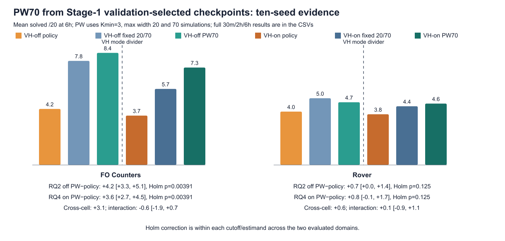

## RQ3 — Does the value head improve Stage-2 policy refinement?

The direct column answers whether VH-on Stage 2 improves its own VH-on Stage-1 policy. The interaction asks whether that refinement is better than the parallel VH-off refinement.

| Domain | VH-on raw S1 → S2 | VH-on direct Δ [95% CI]; raw/Holm p | VH-off Δ | Interaction Δ [95% CI]; raw/Holm p |
|---|---|---|---|---|
| Block Grouping | 15.9 → 12.8 | -3.1 [-5.16, -1.04]; p=0.0156/0.0781 | -0.3 | -2.8 [-4.61, -0.99]; p=0.0176/0.0879 |
| Drone | 5.1 → 5 | -0.1 [-1.34, 1.14]; p=1/1 | 0.8 | -0.9 [-2.88, 1.08]; p=0.377/1 |
| FO Counters | 3.7 → 3.1 | -0.6 [-1.5, 0.3]; p=0.25/1 | -1.3 | 0.7 [-0.26, 1.66]; p=0.2031/0.8125 |
| Rover | 3.8 → 3.9 | 0.1 [-0.31, 0.51]; p=1/1 | 0 | 0.1 [-0.31, 0.51]; p=1/1 |
| Counters | 18.6 → 21.8 | 3.2 [-6.15, 12.55]; p=0.5625/1 | 4.4 | -1.2 [-25.87, 23.47]; p=0.9375/1 |

**Conclusion:** Neither the direct VH-on changes nor the interactions show a corrected-significant benefit. Block Grouping is the clearest harmful tendency; the DiD does not hide a beneficial VH-on result.

### RQ3 extension: PRESERVE-3 validation-led domains

| Domain | VH-on raw S1 → S2 | VH-on direct Δ [95% CI]; raw/Holm p | VH-off Δ | Observed interaction | Scope |
|---|---|---|---|---|---|
| Delivery | 19.2 → 19.6 | 0.4 [-0.37, 1.17]; p=0.5/1 | -0.2 | 0.6 [-0.76, 1.96]; p=0.5/1 | Exploratory post-hoc interaction; separate 3-domain family |
| TPP | 20 → 19.5 | -0.5 [-1.63, 0.63]; p=1/1 | -1.1 | 0.6 [-2.25, 3.45]; p=1/1 | Exploratory post-hoc interaction; separate 3-domain family |
| Zenotravel | 20 → 19.9 | -0.1 [-0.33, 0.13]; p=1/1 | 0 | -0.1 [-0.33, 0.13]; p=1/1 | Exploratory post-hoc interaction; separate 3-domain family |

**Extension conclusion:** The stable domains do not supply evidence that the value head improves refinement. Their near-ceiling scores primarily test preservation. The historical TPP/off 9/20 outlier remains part of the primary RQ3 evidence; a deliberately selected fresh one-epoch rollback/LR-backtracking rerun yielded 20/20 for the bad seed and 20/20 for a stable control, apparently preventing the analogous collapse. Because rejected retries resampled dropout, this remains selected-pair evidence awaiting exact-RNG closure—not a revised primary score or a population-level fix.

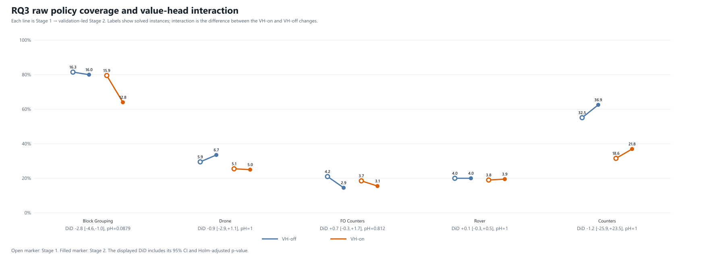

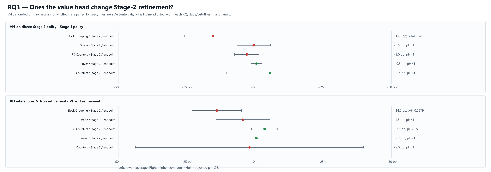

## RQ4 — Does the value head change the benefit of MCTS inference?

These three estimands are deliberately separate.

As in RQ2, these fixed-search values retain the historical action-index tie-break; the live policy-prior experiment is reported separately until its same-build confirmation completes.

### A. VH-on MCTS versus its own VH-on policy

| Stage | Domain | Baseline | 30m: mean; Δ [95% CI]; raw/Holm p | 2h | 6h |
|---|---|---|---|---|---|
| Stage 1 | Block Grouping | 15.9 | **12; -3.9 [-4.94, -2.86]; p=0.002/0.0117** | **14; -1.9 [-2.94, -0.86]; p=0.0098/0.0391** | 16.2; +0.3 [-0.29, 0.89]; p=0.4531/0.9844 |
| Stage 1 | Drone | 5.1 | **10; +4.9 [3.07, 6.73]; p=0.002/0.0117** | **10.4; +5.3 [3.42, 7.18]; p=0.002/0.0117** | **10.4; +5.3 [3.42, 7.18]; p=0.002/0.0117** |
| Stage 1 | FO Counters | 3.7 | **5.3; +1.6 [0.83, 2.37]; p=0.0039/0.0156** | **5.7; +2 [1.05, 2.95]; p=0.0039/0.0195** | **5.7; +2 [1.05, 2.95]; p=0.0039/0.0195** |
| Stage 1 | Rover | 3.8 | 4.4; +0.6 [0, 1.2]; p=0.125/0.25 | 4.4; +0.6 [0, 1.2]; p=0.125/0.375 | 4.4; +0.6 [0, 1.2]; p=0.125/0.5 |
| Stage 1 | Counters | 18.6 | 20.3; +1.7 [-8.94, 12.34]; p=0.7871/0.7871 | 22.1; +3.5 [-5.56, 12.56]; p=0.4531/0.9062 | 22.5; +3.9 [-4.33, 12.13]; p=0.3281/0.9844 |
| Stage 1 | MPrime | 15.7 | 13.3; -2.4 [-4.16, -0.64]; p=0.0234/0.0703 | 15.1; -0.6 [-2.33, 1.13]; p=0.5039/0.9062 | 16; +0.3 [-1.7, 2.3]; p=0.8281/0.9844 |
| Stage 2 | Block Grouping | 12.8 | **10.1; -2.7 [-3.38, -2.02]; p=0.002/0.0098** | **10.6; -2.2 [-3.26, -1.14]; p=0.0078/0.0234** | 12.6; -0.2 [-1.08, 0.68]; p=0.8125/0.8125 |
| Stage 2 | Drone | 5 | **10.9; +5.9 [4.23, 7.57]; p=0.002/0.0098** | **11.2; +6.2 [4.33, 8.07]; p=0.002/0.0098** | **11.2; +6.2 [4.33, 8.07]; p=0.002/0.0098** |
| Stage 2 | FO Counters | 3.1 | **5.2; +2.1 [1.12, 3.08]; p=0.0039/0.0117** | **5.4; +2.3 [1.23, 3.37]; p=0.0039/0.0156** | **5.4; +2.3 [1.23, 3.37]; p=0.0039/0.0156** |
| Stage 2 | Rover | 3.9 | 4.4; +0.5 [-0.2, 1.2]; p=0.25/0.5 | 4.5; +0.6 [-0.09, 1.29]; p=0.1562/0.3047 | 4.5; +0.6 [-0.09, 1.29]; p=0.1562/0.3125 |
| Stage 2 | Counters | 21.8 | 22.6; +0.8 [-8.29, 9.89]; p=0.8691/0.8691 | 26.4; +4.6 [-1.83, 11.03]; p=0.1523/0.3047 | 27.1; +5.3 [-0.7, 11.3]; p=0.082/0.2461 |

### B. VH-on MCTS versus the parallel VH-off policy

| Stage | Domain | Baseline | 30m: mean; Δ [95% CI]; raw/Holm p | 2h | 6h |
|---|---|---|---|---|---|
| Stage 1 | Block Grouping | 16.3 | **12; -4.3 [-5.61, -2.99]; p=0.002/0.0117** | **14; -2.3 [-3.52, -1.08]; p=0.0039/0.0234** | 16.2; -0.1 [-1.38, 1.18]; p=1/1 |
| Stage 1 | Drone | 5.9 | 10; +4.1 [0.25, 7.95]; p=0.0469/0.1465 | 10.4; +4.5 [0.52, 8.48]; p=0.0391/0.1953 | 10.4; +4.5 [0.52, 8.48]; p=0.0391/0.2344 |
| Stage 1 | FO Counters | 4.2 | 5.3; +1.1 [-0.09, 2.29]; p=0.0938/0.1875 | 5.7; +1.5 [-0.05, 3.05]; p=0.0781/0.2812 | 5.7; +1.5 [-0.05, 3.05]; p=0.0781/0.3516 |
| Stage 1 | Rover | 4 | 4.4; +0.4 [-0.1, 0.9]; p=0.25/0.25 | 4.4; +0.4 [-0.1, 0.9]; p=0.25/0.4141 | 4.4; +0.4 [-0.1, 0.9]; p=0.25/0.75 |
| Stage 1 | Counters | 32.5 | 20.3; -12.2 [-23.77, -0.63]; p=0.0332/0.1465 | 22.1; -10.4 [-21.77, 0.97]; p=0.0703/0.2812 | 22.5; -10 [-21.01, 1.01]; p=0.0703/0.3516 |
| Stage 1 | MPrime | 16.3 | 13.3; -3 [-5.29, -0.71]; p=0.0293/0.1465 | 15.1; -1.2 [-2.98, 0.58]; p=0.207/0.4141 | 16; -0.3 [-1.81, 1.21]; p=0.7578/1 |
| Stage 2 | Block Grouping | 16 | **10.1; -5.9 [-6.94, -4.86]; p=0.002/0.0098** | **10.6; -5.4 [-6.8, -4]; p=0.002/0.0098** | **12.6; -3.4 [-4.8, -2]; p=0.0039/0.0195** |
| Stage 2 | Drone | 6.7 | 10.9; +4.2 [0.8, 7.6]; p=0.0312/0.0938 | 11.2; +4.5 [1.01, 7.99]; p=0.0293/0.0879 | 11.2; +4.5 [1.01, 7.99]; p=0.0293/0.0879 |
| Stage 2 | FO Counters | 2.9 | 5.2; +2.3 [0.58, 4.02]; p=0.0234/0.0938 | 5.4; +2.5 [0.77, 4.23]; p=0.0156/0.0625 | 5.4; +2.5 [0.77, 4.23]; p=0.0156/0.0625 |
| Stage 2 | Rover | 4 | 4.4; +0.4 [-0.2, 1]; p=0.3125/0.3125 | 4.5; +0.5 [-0.11, 1.11]; p=0.1875/0.375 | 4.5; +0.5 [-0.11, 1.11]; p=0.1875/0.375 |
| Stage 2 | Counters | 36.9 | 22.6; -14.3 [-30.21, 1.61]; p=0.0781/0.1562 | 26.4; -10.5 [-29.15, 8.15]; p=0.2383/0.375 | 27.1; -9.8 [-28.82, 9.22]; p=0.2891/0.375 |

### C. Difference in MCTS benefit: VH-on minus VH-off

| Stage | Domain | Baseline | 30m: mean; Δ [95% CI]; raw/Holm p | 2h | 6h |
|---|---|---|---|---|---|
| Stage 1 | Block Grouping | -4.7 | -3.9; +0.8 [-0.26, 1.86]; p=0.1875/0.625 | -1.9; -0.4 [-1.67, 0.87]; p=0.6289/1 | 0.3; +1.2 [0.14, 2.26]; p=0.0625/0.2539 |
| Stage 1 | Drone | 1 | **4.9; +3.9 [1.86, 5.94]; p=0.0078/0.0469** | **5.3; +4.3 [2.19, 6.41]; p=0.0078/0.0469** | **5.3; +4.3 [2.19, 6.41]; p=0.0078/0.0469** |
| Stage 1 | FO Counters | 3.3 | 1.6; -1.7 [-3.09, -0.31]; p=0.0352/0.1758 | 2; -1.6 [-3.04, -0.16]; p=0.0508/0.2539 | 2; -1.6 [-3.04, -0.16]; p=0.0508/0.2539 |
| Stage 1 | Rover | 0.8 | 0.6; -0.2 [-1.08, 0.68]; p=0.8438/0.9219 | 0.6; -0.4 [-1.37, 0.57]; p=0.5156/1 | 0.6; -0.4 [-1.37, 0.57]; p=0.5156/1 |
| Stage 1 | Counters | -7.6 | 1.7; +9.3 [-4.46, 23.06]; p=0.1562/0.625 | 3.5; +10.4 [-4.34, 25.14]; p=0.1484/0.5938 | 3.9; +10.7 [-3.3, 24.7]; p=0.1289/0.3867 |
| Stage 1 | MPrime | -3.3 | -2.4; +0.9 [-1.52, 3.32]; p=0.4609/0.9219 | -0.6; +1 [-1.7, 3.7]; p=0.5059/1 | 0.3; +0.9 [-1.91, 3.71]; p=0.6113/1 |
| Stage 2 | Block Grouping | -4.6 | -2.7; +1.9 [0.76, 3.04]; p=0.0156/0.0625 | -2.2; -1.2 [-2.81, 0.41]; p=0.1562/0.625 | -0.2; +0.1 [-0.82, 1.02]; p=1/1 |
| Stage 2 | Drone | 0.8 | **5.9; +5.1 [3.3, 6.9]; p=0.002/0.0098** | **6.2; +5.2 [3.24, 7.16]; p=0.002/0.0098** | **6.2; +5.2 [3.24, 7.16]; p=0.002/0.0098** |
| Stage 2 | FO Counters | 3.2 | 2.1; -1.1 [-2.7, 0.5]; p=0.1953/0.5859 | 2.3; -0.9 [-2.31, 0.51]; p=0.2344/0.6445 | 2.3; -0.9 [-2.31, 0.51]; p=0.2344/0.7031 |
| Stage 2 | Rover | 0.5 | 0.5; 0 [-0.58, 0.58]; p=1/1 | 0.6; +0.1 [-0.43, 0.63]; p=1/1 | 0.6; +0.1 [-0.43, 0.63]; p=1/1 |
| Stage 2 | Counters | -2 | 0.8; +2.8 [-9.12, 14.72]; p=0.5977/1 | 4.6; +4.8 [-2.97, 12.57]; p=0.2148/0.6445 | 5.3; +5.5 [-1.97, 12.97]; p=0.1367/0.5469 |

**Conclusion:** Drone is the robust RQ4 success: VH-on materially increases MCTS usefulness. FO Counters benefits strongly from search in both VH modes, but its exact interaction is not significant—VH-on does not add a reliable extra gain there. Other domains do not show a reliable value-head interaction.

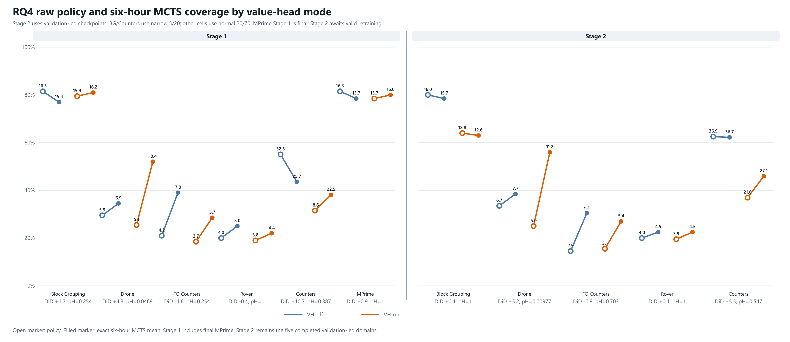

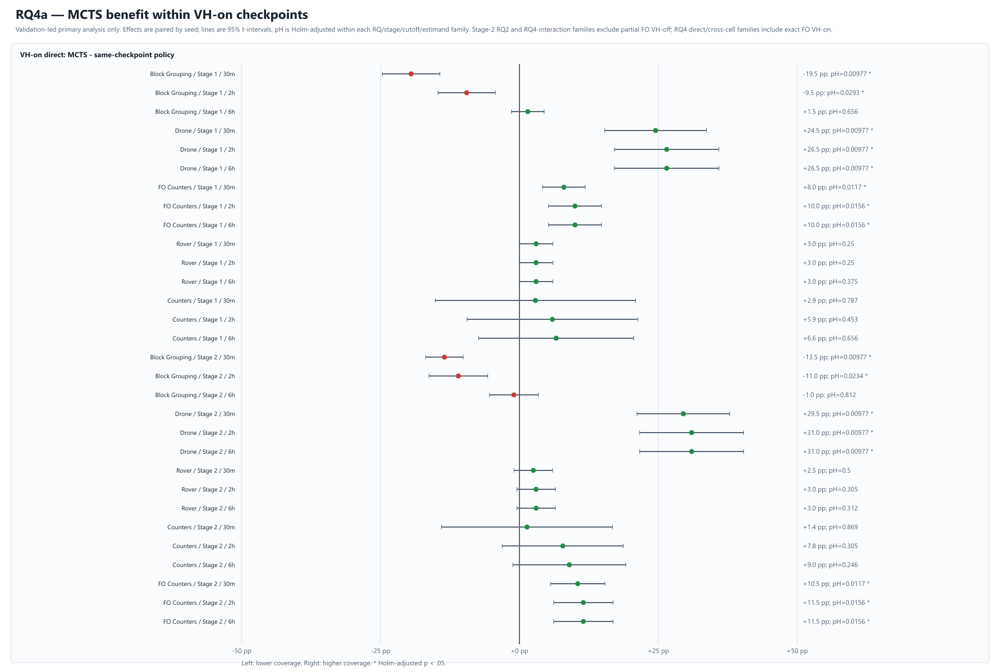

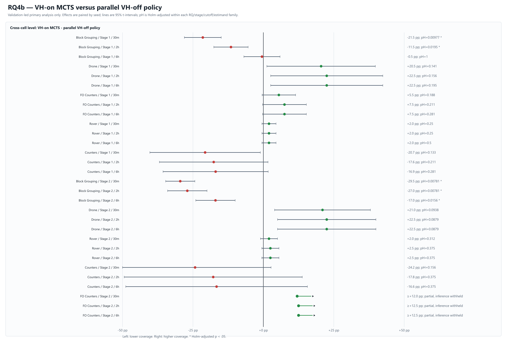

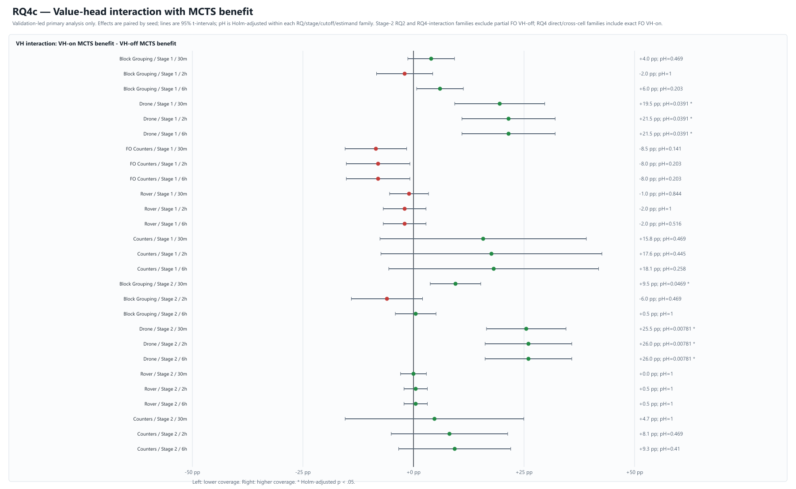

### PW70 contribution to RQ4 (Stage 1 confirmation)

| Domain | Estimand | Raw means (policy; PW 30m / 2h / 6h) | Effect [95% CI] at 30m / 2h / 6h | Raw/Holm p at 30m / 2h / 6h |
|---|---|---|---|---|
| FO Counters | (on PW70-policy benefit) - (VH-off PW70-policy benefit) | off policy 4.2; on policy 3.7; off PW 8.4 / 8.4 / 8.4; on PW 7.3 / 7.3 / 7.3 | -0.6 [-1.87, 0.67] / -0.6 [-1.87, 0.67] / -0.6 [-1.87, 0.67] | 0.4141/1 / 0.4141/1 / 0.4141/0.9141 |
| FO Counters | on PW70 - on policy | off policy 4.2; on policy 3.7; off PW 8.4 / 8.4 / 8.4; on PW 7.3 / 7.3 / 7.3 | **3.6 [2.7, 4.5]** / **3.6 [2.7, 4.5]** / **3.6 [2.7, 4.5]** | **0.002/0.0059** / **0.002/0.0059** / **0.002/0.0059** |
| FO Counters | on PW70 - off policy | off policy 4.2; on policy 3.7; off PW 8.4 / 8.4 / 8.4; on PW 7.3 / 7.3 / 7.3 | **3.1 [2.18, 4.02]** / **3.1 [2.18, 4.02]** / **3.1 [2.18, 4.02]** | **0.002/0.0059** / **0.002/0.0059** / **0.002/0.0059** |
| Rover | (on PW70-policy benefit) - (VH-off PW70-policy benefit) | off policy 4; on policy 3.8; off PW 4.7 / 4.7 / 4.7; on PW 4.5 / 4.6 / 4.6 | 0 [-1.07, 1.07] / 0.1 [-0.88, 1.08] / 0.1 [-0.88, 1.08] | 1/1 / 1/1 / 1/1 |
| Rover | on PW70 - on policy | off policy 4; on policy 3.8; off PW 4.7 / 4.7 / 4.7; on PW 4.5 / 4.6 / 4.6 | 0.7 [-0.2, 1.6] / 0.8 [-0.08, 1.68] / 0.8 [-0.08, 1.68] | 0.25/0.5 / 0.125/0.125 / 0.125/0.125 |
| Rover | on PW70 - off policy | off policy 4; on policy 3.8; off PW 4.7 / 4.7 / 4.7; on PW 4.5 / 4.6 / 4.6 | 0.5 [-0.2, 1.2] / 0.6 [-0.09, 1.29] / 0.6 [-0.09, 1.29] | 0.25/0.5 / 0.125/0.25 / 0.125/0.125 |
| MPrime | (on PW70-policy benefit) - (VH-off PW70-policy benefit) | off policy 16.3; on policy 15.7; off PW 15.7 / 17.6 / 17.7; on PW 15.5 / 17.9 / 18.5 | 0.4 [-1.82, 2.62] / 0.9 [-1.5, 3.3] / 1.4 [-1.17, 3.97] | 0.7656/1 / 0.4727/1 / 0.3047/0.9141 |
| MPrime | on PW70 - on policy | off policy 16.3; on policy 15.7; off PW 15.7 / 17.6 / 17.7; on PW 15.5 / 17.9 / 18.5 | -0.2 [-1.45, 1.05] / **2.2 [0.7, 3.7]** / **2.8 [1.23, 4.37]** | 0.8594/0.8594 / **0.0195/0.0391** / **0.0039/0.0078** |
| MPrime | on PW70 - off policy | off policy 16.3; on policy 15.7; off PW 15.7 / 17.6 / 17.7; on PW 15.5 / 17.9 / 18.5 | -0.8 [-2.55, 0.95] / 1.6 [-0.43, 3.63] / 2.2 [0.27, 4.13] | 0.3828/0.5 / 0.1406/0.25 / 0.041/0.082 |

Direct VH-on PW70 versus the corresponding VH-on fixed-search arm:

| Domain | VH-on fixed 30m / 2h / 6h | VH-on PW70 30m / 2h / 6h | PW−fixed [95% CI] at 30m / 2h / 6h | Raw/Holm p |
|---|---|---|---|---|
| FO Counters | 5.3 / 5.7 / 5.7 | 7.3 / 7.3 / 7.3 | **2 [1.05, 2.95]** / **1.6 [0.52, 2.68]** / **1.6 [0.52, 2.68]** | **0.0078/0.0176** / **0.0234/0.0469** / **0.0234/0.0469** |
| Rover | 4.4 / 4.4 / 4.4 | 4.5 / 4.6 / 4.6 | 0.1 [-0.88, 1.08] / 0.2 [-0.8, 1.2] / 0.2 [-0.8, 1.2] | 1/1 / 0.8281/0.8281 / 0.8281/0.8281 |
| MPrime | 13.3 / 15.1 / 16 | 15.5 / 17.9 / 18.5 | **2.2 [1.2, 3.2]** / **2.8 [2.06, 3.54]** / **2.5 [1.47, 3.53]** | **0.0059/0.0176** / **0.002/0.0059** / **0.0039/0.0117** |

**Conclusion:** PW preserves the distinction seen with fixed search: FO Counters and MPrime have strong search gains, while Rover shows parity-scale, non-significant effects. MPrime VH-on PW reaches 18.5/20 at six hours, but its VH-on-versus-VH-off benefit interaction is not significant. PW therefore strengthens RQ2 more than RQ4.

## Results still required

The statistical tables above are frozen to completed scientific evidence. Live
operational counts are maintained only in
[`../status_latest.md`](../status_latest.md) so this report does not embed a
second stale scheduler snapshot.

1. **MPrime Stage 2:** final validation-led training, learning curves, endpoint
   selection, and the approved matched fixed/PW evaluations remain incomplete.
   MPrime enters RQ1/RQ3 and Stage-2 RQ2/RQ4 only after those endpoints finish.
2. **Counters tie-break:** the strict ten-seed same-build result remains frozen
   until every identity is terminal. The dependency-gated trace then reruns
   only policy-success/action-ID-failure identities with complete root vectors.
   The standardized visit-margin/prominence branch remains held.
3. **TPP causal closure:** the selected-pair guard prevented the historical
   first-update collapse, but exact-RNG closure is still needed to distinguish
   rollback/learning-rate scaling from dropout resampling. No 100-epoch guard
   campaign is part of the primary RQs.

Canonical evidence files: [`rq_primary_validation_led.csv`](rq_primary_validation_led.csv), [`rq2_raw_means_validation_led.csv`](rq2_raw_means_validation_led.csv), [`rq3_raw_means_validation_led.csv`](rq3_raw_means_validation_led.csv), [`rq4_raw_means_validation_led.csv`](rq4_raw_means_validation_led.csv), [`rq2_pw70_branch_latest.csv`](rq2_pw70_branch_latest.csv), and [`rq4_pw70_branch_latest.csv`](rq4_pw70_branch_latest.csv). Their row-level job/log routes are indexed in [`../result_csv_provenance_index_latest.csv`](../result_csv_provenance_index_latest.csv).
